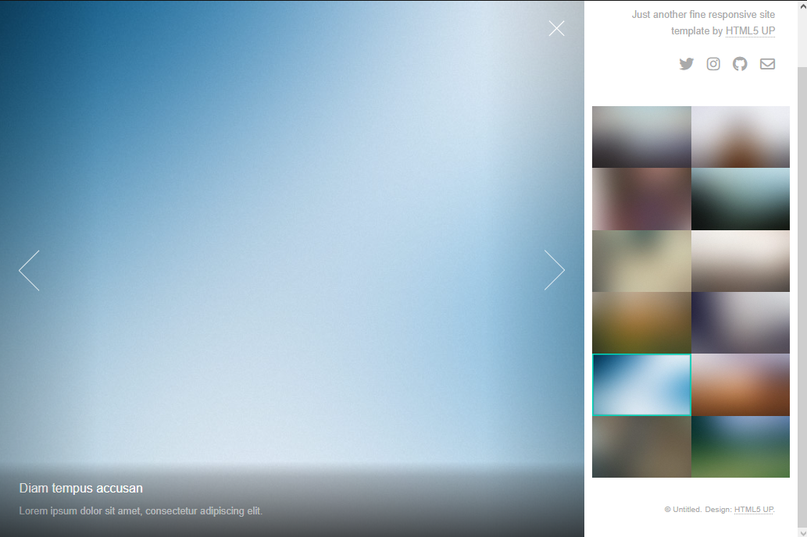

# Plantilla en rails 2

Aplicacion de una plantilla de html5 llamada Lens en rails, para demostrar las integracion y aplicacion de Templates

## Descripción

La página muestra imágenes en una barra lateral, al hacer click muestra la imagen en grande con una peuqeña descripción

## Visuales



## Vamos al lio de Monte Pio 🏔️

A continuación dejaré las instrucciones para ayudarte a replicar este proyecto en funcionamiento en tu computadora para propósitos de desarrollo, pruebas o aprendizaje.

### Prerrequisitos 📋

Esto es lo que necesitaremos respecto a herramintas, complementos y lenguaje de programación en conjunto con sus versiones para una correcta ejecución este proyecto: 

- Sistema Operativo windows, ubuntu o mac
- Lenguaje de programación Ruby 3.2.2
- Framework Rails 7.0.6

### Instalación 🔧

Clona el repositorio con el siguiente comando, puedes hacerlo a traves de la terminal de git, en caso que sea complicado puedes usar la aplicacion de escritorio o simplemente descargarlo del link a continuacion.

```bash
git clone https://github.com/DevilAbbath/lensRails.git
```

Ya una vez descargado accedemos a la terminal y nos dirigimos al path o ruta donde se encuentra el repositorio y ejecuta el siguiente comando en la terminal, puede ser por visual studio o la del sistema operativo (recuerda que para que esto funcione debes tener instalado ruby y la gema bundle)

```bash
bundle install
```

Finalmente ejecuta el proyecto con el siguiente comando y ve a la ip que saldra en la consola

```bash
rails s
```

## Desarrollado con 🛠️

- [Ruby](https://www.ruby-lang.org/es/) - El lenguaje utilizado
- [Ruby on Rails](https://rubyonrails.org) - El framework web utilizado
- [Ruby gems](https://rubygems.org) - Gestión de dependencias
- [Html5Lens](https://html5up.net/lens) - Codigo fuente

## Soporte

Si tienes algún problema o sugerencia, por favor abre un Issue [aquí](https://github.com/DevilAbbath/lensRails/issues).

## Autor ✒️

- **Erick Jaime Jara** - Soporte Nivel 3 - [Erick Jaime Jara](https://github.com/DevilAbbath)
